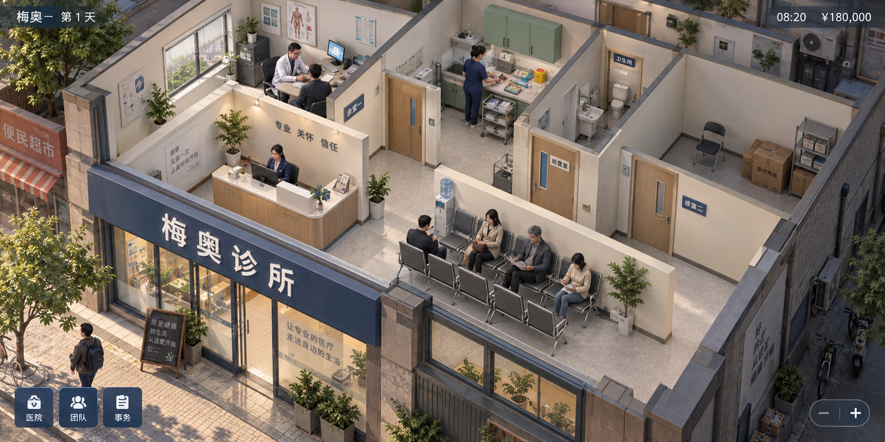
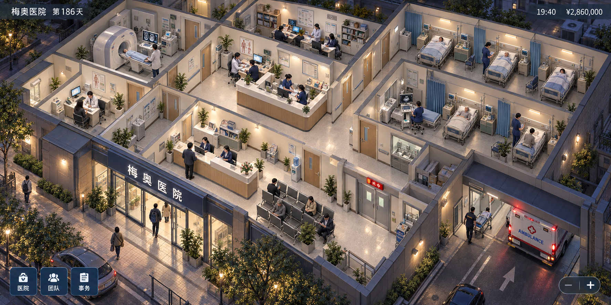
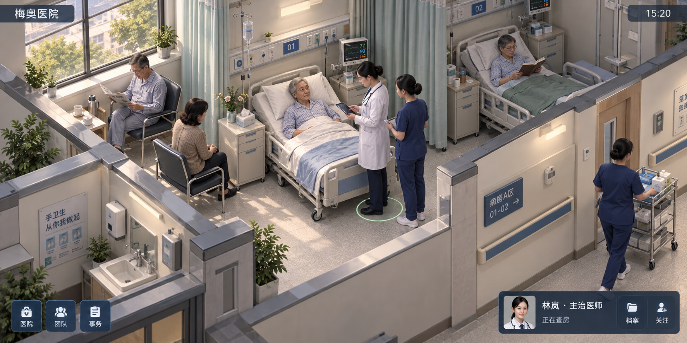
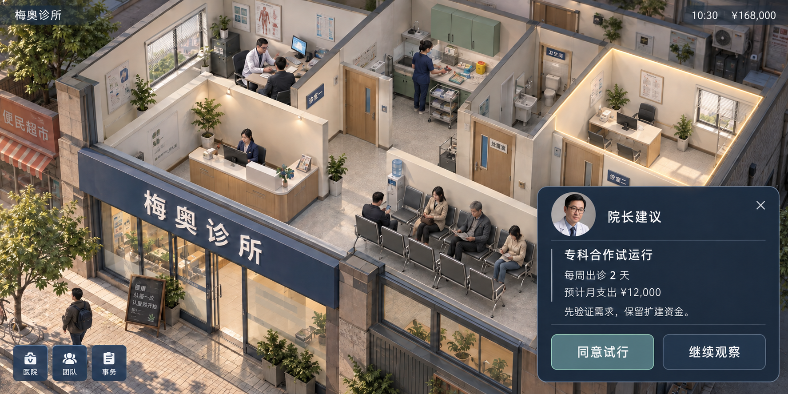

# 梅奥：第一组视觉概念图

本组使用内置 image_gen 生成，原图与完整提示词同目录保存。用于讨论视觉方向，不代表可运行游戏、最终美术成本、医疗空间规范或经测试的手机界面。横屏约 2:1，偏写实的等距剖面；角色和医院活动占主要画面，操作入口收在边缘。

| 图 | 场景 | 探索目标 |
| --- | --- | --- |
| 01 | 小诊所开局 | 看清入口、接诊、候诊及未来扩展空间 |
| 02 | 成长后的医院夜景 | 观察多个科室及病区持续运行 |
| 03 | 病区近距离观察 | 选中人物时只显示简短身份和状态 |
| 04 | 展开管理建议 | 保留医院画面，展示短建议与自愿决策入口 |

## 待评议

- 画面偏精细建筑效果图，尚需判断是否应简化为更清楚的游戏美术。
- 原图细节在手机实际尺寸下的可读性、墙体遮挡、触控面积与动态表现尚未测试。
- 01 的墙面标语仍偏多；04 的管理面板仍可缩小，且高亮房间的家具状态需在真实界面中严格区分预览与已建设。
- 数值、日期、文字、人物姓名、空间配置都是概念示例，不能当作已批准机制或临床规范。
- 后续根据用户反馈迭代，不以生成图中偶然出现的细节反推产品需求。

完整生成提示词见 `prompts.json`。本组保留四张 PNG 原图，没有转换或修改像素。
