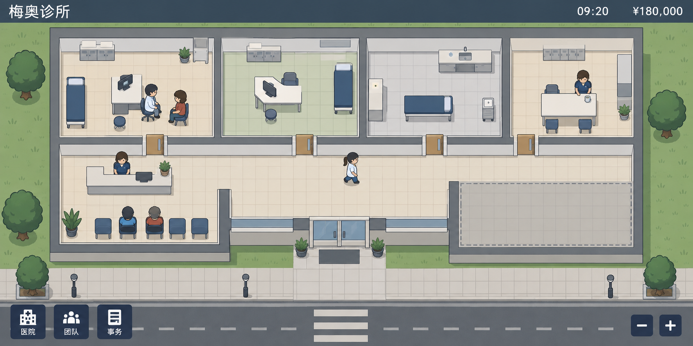

# 已确认画风：固定视角 2D 医院

状态：用户已明确认可此画风（“这个画风可以！”）。本图是后续美术基准；具体布局、示例数字、按钮功能与资产制作方式仍需在原型中落实。

用户指出 v01 精细写实画风的开发难度过大。本图探索固定俯视/略带侧面的 2D 房间与角色素材，采用可复用的房间、墙、家具和少量人物动作，减少建模、复杂光照与自由镜头需求。

这是使用内置 image_gen 生成的方向图，完整提示词见 `prompt.json`。它不是可直接投入引擎的瓦片集、人物动画或可玩界面；这些仍需制作。保留已认可的简化人物和低细节风格，通过布局、行为和医疗流程体现严肃性。实际开发成本仍取决于动画数量、建造自由度、寻路和模拟系统的范围。

候选原型范围：固定镜头，整间科室模块，少量设备素材，人物走路/坐下/工作三类基础状态；先验证患者流动与管理层自主经营，再增加视觉细节。画风已确认，具体实现范围和技术栈尚未确认。
